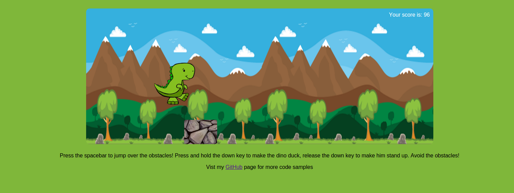

# DinoJump

Welcome to DinoJump!

DinoJump is a browser game inspired by the Google Chrome
"Unable to connect to the Internet" game. Go ahead and disconnect from the Internet (just breathe, it will be okay),
try to go to a webpage in Google Chrome and hit the spacebar to see what I'm talking about.

The objective of the game is to avoid the obstacles. After selecting a difficulty,
obstacles will start to appear. Your job is to make the Dino jump over them! You can
use the spacebar to make the Dino jump. Keep playing the game until you
make contact with an obstacle (hopefull this is never).

Technologies used to develop this application include:

* Javascript

* HTML

* CSS

### Screenshots
Landing page of the game:

Mid-jump:

